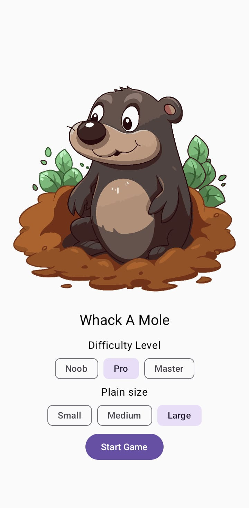
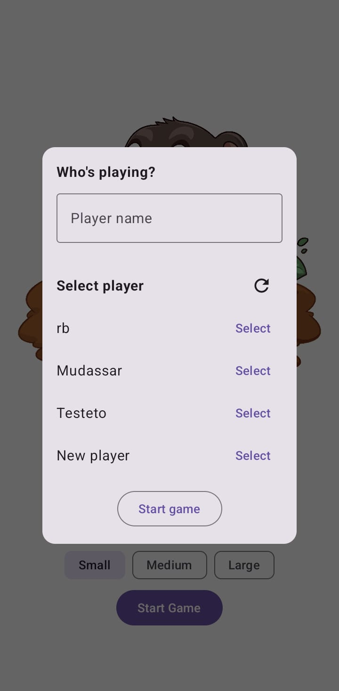
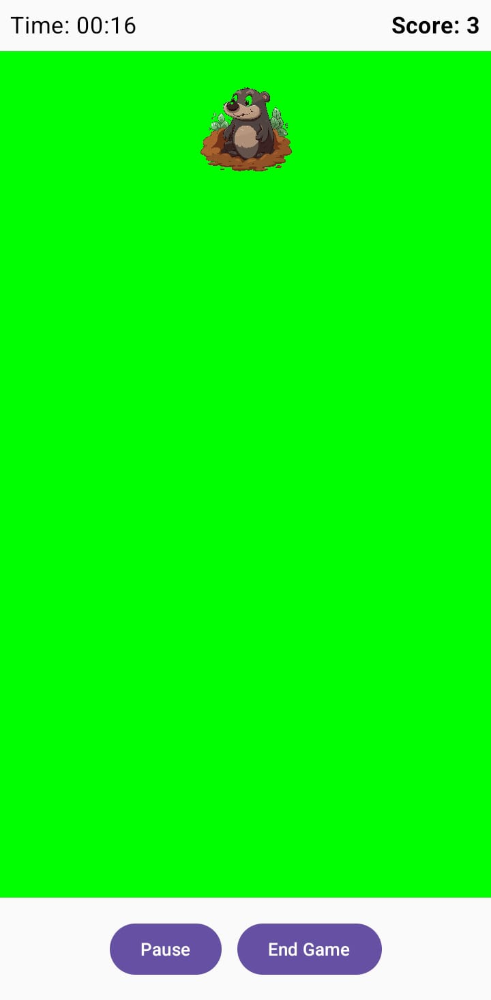
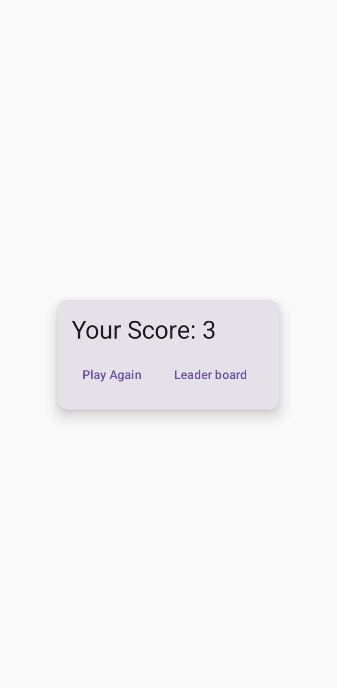
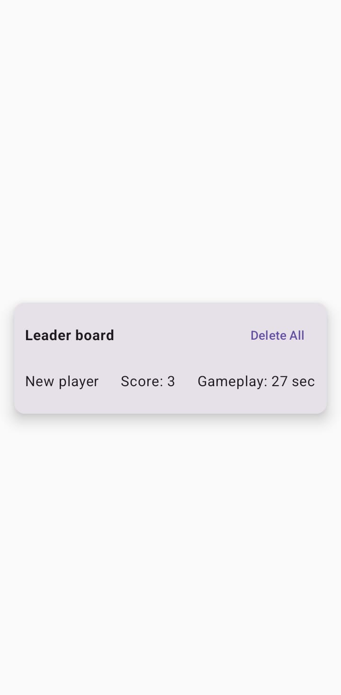

# **Whack A Mole – Jetpack Compose** 🎯

A simple and classic **Whack-A-Mole** game built entirely using **Jetpack Compose**. This side project explores **state management**, **dynamic UI updates**, and **coroutines for smooth gameplay**.  

## **Features** 🚀  
✔️ **Mole Tap Detection** – Tap the mole to score points!  
✔️ **Dynamic UI Updates** – Mole position updates dynamically.  
✔️ **Game Timer & Score Tracking** – Keep track of your progress.  
✔️ **Pause & Resume Gameplay** – Manage game state efficiently.  
✔️ **Sound Effects** – Fun sound effects when tapping the mole and game over.  
✔️ **Leader Board** – A score board to display highest scores.  
✔️ **Jetpack Compose State Management** – Fully declarative UI.  

## **Tech Stack** 🛠  
- **Kotlin** – Modern, concise, and powerful.  
- **Jetpack Compose** – Declarative UI for Android.  
- **Coroutines & Flow** – Efficient background processing.  
- **State Management** – Uses `MutableStateFlow` for real-time updates.  
- **SoundPool API** – Lightweight sound effects for better experience.  

## **Screenshots** 📸  
### Home Screen

### Add/Select Player 

### GamePlay

### Score

### Leaderboard

## **How to Run the Project** 🏃‍♂️  
1. Clone the repository:  
2. Open the project in **Android Studio (Latest)**.  
3. Build & Run on an **Android Emulator or Physical Device**.  

## **How It Works** 🎮  
- The game starts with **random moles appearing** on the grid.  
- Tap the mole **before it disappears** to score points.  
- The game keeps track of **time, score, and mole position** dynamically.  
- You can **pause and resume** the game at any time.  
- **Sound effects** play when you tap the mole.  

## **To-Do / Future Improvements** 🚧  
- Improve **animations & UI effects** for better experience.

## **Contributing** 🤝  
Anyone learning compose is welcome. Feel free to fork this repository and submit **pull requests** with your creative enhancements to this project.  
